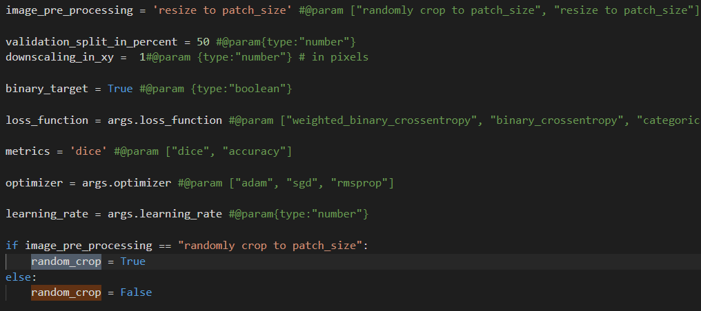
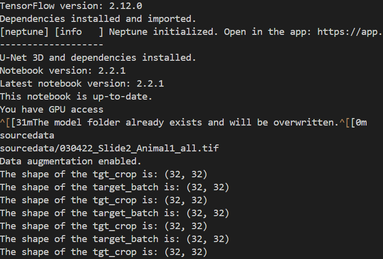

New images from Doe's lab were shared through FTP and they were transferred to the `imaging_dropbox`. The images were transferred to `\2022_09_21_COBA_ChrisDoe_Lab\NewBatch` in `imaging_analysis`. 
The details of the files, 

```
181G    NewBatch/
3.9G    doelab/

3005 : .
2996 : ./NewBatch
   8 : ./doelab

```

The files that were in `imaging_dropbox`

```
179G    doelab/

```

Some of the files were converted to tiff format and saved in the `imaging_analysis` hence we find difference in the folder size. 


Out of the many images that they shared, only some of the files (the files in Z:\2022_09_21_COBA_ChrisDoe_Lab\NewBatch\doelab\dbd_A08a_Dendrite_Project\_Data_for_2022_Paper\060221_-_dbd_hid,_A08a_dendrites_for_Paper\Trial_1\) were compatible with ImageJ Bioformats. Other images were having issues opening in ImageJ hence the initial plan is to include ony these images for training. 

Following steps were followed before adding them to the training set, 

* Open the .ims files in ImageJ using Bioformats and save these files in tiff format.
* With the SNT prompt choose the image file in tiff and one of the swc files as the reconstruction file with the corresponding tracking channel,


* To get all the swc files as one image, SNT -> Load Tracings -> Directory of SWCs 
* In the path manager -> Ctrl A all paths -> Analyze -> Skeletonize 
* Save the masks as tiff 
* Reconstructions do not cover the entire image, only portion of it are annotated. Hence the image is cropped based on the annotated region. 
* The masks, original image are synced and cropped together.  


### Understanding the code 

*Packages:*

* random - generates pseudo-random numbers and perfrom random operations
* h5py - lets you create, read and modify HDF5 files.
* imageio - the package that lets you read and write images in a variety of formats
* math - provides mathematical functions and constants for performing mathematical operations
* shutil -  provides utility for file and directory management 
* tqdm - used for creating progress bars in loops and iterative processes. Useful for tasks that takes longer to complete
* tensorflow - open-source ML framework developed by Google. Widely used for building, training and deploying ML and DL models. 
* ipywidgets - provides interactive widgets for Jupyter notebooks and other interactive computing environments. 
* fpdf - creates PDF documents programmatically (including text, image and graphics); does not require any dependencies. 
* datetime - a library to get the current time and date.
* subprocess - used to spawn new processes, connect to their input/output/error pipes, and obtain their return codes. It allows Python scripts to interact with external programs, execute system commands, and manage subprocesses effectively.
* time - gets timestamps 


***Generators*** are generally used to yield batches of data on the fly to save memory, especially for large datasets. 

* `tf.keras.utils.Sequence` is used to run batches in parallel 

* batch_size - no of samples to include in each batch.  No of images that are loaded per iteration. 

* shape - shape of the input data 


Based on the discussion with Beth following are the places that I need to look for, 

* Random crop - false

I tried setting it to False by choosing the `image_pre_processing` to `randomly crop to patch_size` based on the following,



It seems this did not help since the dice coefficient of validation is still similar to the previous runs. 


**Questions:**

* Why augment factor is 4 or 1 based whether the boolean is True or False? What does augment factor mean?
* Why the train_generator.source.shape is the following? 
```
In [4]: train_generator.source.shape
Out[4]: (152, 314, 554)
```

* What is the difference between the `training_source` and the `source_path`?


**Troubleshooting:**

To run the docker locally I used the following, 

Beth shared this - `docker run --rm -v local/path:/Docker/absolute/path --entrypoint /bin/sh -it your/Docker:tag`

This is the one that I used ((Initially the same command was giving errors but ran after restarting the laptop :) ), 

`docker run --rm -v /c/Users/ssivagur/Documents/GitHub/DBP_Doe:/app --entrypoint /bin/sh -it suganyasivaguru/dbpdoe:v1`

Once running it locally, I edited the code to access the local files for source and target and also turned off the neptune logs since it is for debugging. The new fils is named as `ScriptForLocalRun.py`

I added the source and target images in the mounted folder after mounting which meant I need to re-mount so docker was able to find it and I also just mentioned the folder name without giving the entire path since the docker is alerady in the mounted folder. These changes helped in making the script run locally and also was training with one image that I provided. 


Based on the comparison between the code that I had for the local run (the utils file specifically) or on the docker with the code from the DL4MicEverywhere notebook (3D UNet), we found only the `if` statement in the following function being commented out earlier since we had an error.

```
def deform_volume(self, src_vol, tgt_vol):
        [src_dfrm, tgt_dfrm] = elasticdeform.deform_random_grid([src_vol, tgt_vol],
                                                                axis=(1, 2, 3),
                                                                sigma=self.deform_sigma,
                                                                points=self.deform_points,
                                                                order=self.deform_order)
        if self.binary_target:
           tgt_dfrm = tgt_dfrm > 0.1

        return self._min_max_scaling(src_dfrm), tgt_dfrm
```

I am trying to run the script again uncommenting those. If that works well I will proceed with the same code else I will start with the notebook that is on `DL4MicEverywhere`. 

Uncommenting the `if` statement above resulted in better dice coefficient during the validation phase. This is in the commit - https://github.com/broadinstitute/DBP_Doe/commit/8c7f5cfadc770b833a1b5e816e7e1cb5e6fc8789


2024/12/20 


All the jobs that were submitted on the 20th were on hold since the machines did not match the requirements. I have to check if this is due to some of the changes that were made to CHTC recently or something else. (This might not be the reason since the test jobs that were tested on the 19th evening was all fine - these had lesser epochs)


2025/01/21

Since all the submitted jobs were idle I wrote to CHTC team at UWisconsin-Madison and Andrew Owen replied the following, 

**"looking at the last job you submitted, it appears that you are requiring the job to run on "coba2000.chtc.wisc.edu" *and* that it run on CentOS7 or CentOS8. Since coba2000 is running CentOS9, the conflicting requirements would explain why your jobs are not starting."**

And this is what he recommended, 

**"In your submit file, change the line

requirements = (Machine == "coba2000.chtc.wisc.edu") && (OpSysMajorVer == 7 ||
OpSysMajorVer == 8)

to

requirements = (Machine == "coba2000.chtc.wisc.edu")"** 

After making the above changes, I was getting the following error, 

"Traceback (most recent call last): File "/var/lib/condor/execute/slot1/dir_1550131/FromScratch.py", line 1225, in <module> src_sample = tifffile.imread(training_source_sample) File "/usr/local/lib/python3.10/dist-packages/tifffile/tifffile.py", line 1094, in imread with TiffFile( File "/usr/local/lib/python3.10/dist-packages/tifffile/tifffile.py", line 4035, in __init__ fh = FileHandle(file, mode=mode, name=name, offset=offset, size=size) File "/usr/local/lib/python3.10/dist-packages/tifffile/tifffile.py", line 14020, in __init__ self.open() File "/usr/local/lib/python3.10/dist-packages/tifffile/tifffile.py", line 14035, in open self._fh = open( FileNotFoundError: [Errno 2] No such file or directory: '/var/lib/condor/execute/slot1/dir_1550131/doe'
2025/01/21 14:40:26	Traceback (most recent call last): File "/var/lib/condor/execute/slot1/dir_1550131/FromScratch.py", line 1225, in <module> src_sample = tifffile.imread(training_source_sample) File "/usr/local/lib/python3.10/dist-packages/tifffile/tifffile.py", line 1094, in imread with TiffFile( File "/usr/local/lib/python3.10/dist-packages/tifffile/tifffile.py", line 4035, in __init__ fh = FileHandle(file, mode=mode, name=name, offset=offset, size=size) File "/usr/local/lib/python3.10/dist-packages/tifffile/tifffile.py", line 14020, in __init__ self.open() File "/usr/local/lib/python3.10/dist-packages/tifffile/tifffile.py", line 14035, in open self._fh = open(FileNotFoundError: [Errno 2] No such file or directory: '/var/lib/condor/execute/slot1/dir_1550131/doe'
"

The above error was happening because I was not running the right file on the CHTC. The DBPDOE- 407 to DBPDOE 419 are errored because I did not run the right file. 


Andrew suggested to do the following,  

"I did notice that you had "universe = docker" in your submit file.
HTCondor has been slowly moving away from that to a general "container"
universe. In principle, they should work the same, but may not in practice.

You can try replacing

universe = docker
docker_image = yourDocker/image:tag

with

universe = container
container_image = docker://yourDocker/image:tag

in your submit file.
"

With all of the above changes, the jobs get submitted but I get the following error, 

```
Traceback (most recent call last):

  File "/usr/local/lib/python3.10/dist-packages/tensorflow/python/ops/script_ops.py", line 267, in __call__
    ret = func(*args)

  File "/usr/local/lib/python3.10/dist-packages/tensorflow/python/autograph/impl/api.py", line 642, in wrapper
    return func(*args, **kwargs)

  File "/usr/local/lib/python3.10/dist-packages/tensorflow/python/data/ops/from_generator_op.py", line 198, in generator_py_func
    values = next(generator_state.get_iterator(iterator_id))

  File "/usr/local/lib/python3.10/dist-packages/keras/engine/data_adapter.py", line 902, in wrapped_generator
    for data in generator_fn():

  File "/usr/local/lib/python3.10/dist-packages/keras/engine/data_adapter.py", line 1049, in generator_fn
    yield x[i]

  File "/var/lib/condor/execute/slot1/dir_1818261/FromScratch.py", line 282, in __getitem__
    target_batch[batch,:,:,i,0] = tgt_crop

ValueError: could not broadcast input array from shape (31,32) into shape (32,32)


         [[{{node PyFunc}}]]
         [[IteratorGetNext]]
0 successful operations.
0 derived errors ignored. [Op:__inference_train_function_7465]
tar: output: Cannot stat: No such file or directory
tar: Exiting with failure status due to previous errors

```

Although the same code was running without any errors earlier???? I tried changing the patch size but did not help. 


I tried to print out the shapes to see what is going on and I saw the shapes are the same (???), 




Beth suggested to include a `print` statement in `try` and `except` statement to see how random there is a shape mismatch which was made in this commit - https://github.com/broadinstitute/DBP_Doe/commit/6106e43dc71ee6f055d9b2230d87b0c01a83fb3f and the following commits until the one on 18th Feb, 2025. I made some errors in the indentation in adding the `print` statements hence it took a couple of commits to set it right. 

2025/02/21

DBPDOE-448 

The error shows the following, 

`/usr/local/lib/python3.10/dist-packages/IPython/paths.py:69: UserWarning: IPython parent '/' is not a writable location, using a temp directory. warn("IPython parent '{0}' is not a writable location,"`


Things that were tried, 

1. The first thing that I tried was to comment out the IPython embed statement. 

`#__import__("IPython").embed()`

Result of DBPDOE-450 - 

`2025/02/21 10:33:17	[neptune] [warning] /var/lib/condor/execute/slot1/dir_1466459/ScriptForLocalRun.py:321: NeptuneUnsupportedType: You're attempting to log a type that is not directly supported by Neptune (<class 'tuple'>). Convert the value to a supported type, such as a string or float, or use stringify_unsupported(obj) for dictionaries or collections that contain unsupported values. For more, see https://docs.neptune.ai/help/value_of_unsupported_type
2025/02/21 10:33:17	[neptune] [warning] /var/lib/condor/execute/slot1/dir_1466459/ScriptForLocalRun.py:321: NeptuneUnsupportedType: You're attempting to log a type that is not directly supported by Neptune (<class 'NoneType'>). Convert the value to a supported type, such as a string or float, or use stringify_unsupported(obj) for dictionaries or collections that contain unsupported values. For more, see https://docs.neptune.ai/help/value_of_unsupported_type
2025/02/21 10:33:17	Traceback (most recent call last): File "/var/lib/condor/execute/slot1/dir_1466459/ScriptForLocalRun.py", line 405, in <module> val_generator = utils.MultiPageTiffGenerator(training_source, File "/var/lib/condor/execute/slot1/dir_1466459/utils.py", line 142, in __init__ self.on_epoch_end() File "/var/lib/condor/execute/slot1/dir_1466459/utils.py", line 337, in on_epoch_end raise ValueError('validation_split too small! Increase val_split or decrease z-depth') ValueError: validation_split too small! Increase val_split or decrease z-depth`

The sample images were the EM images that I downloaded from the sample dataset so I will try after I sample one of the neurite images and see how it goes. 

**DBPDOE-451:**

Based on the previous run, I changed the data to be a single image of the neurite dataset which exists in the following  folder, 

`/home/sivagurunath/project/DBP_Doe/data/sourcedata_oneimage` and the image is `030422_Slide2_Animal1_all.tif` and the corresponding mask - `030422_Slide2_Animal1_all_masks.tif` which exists in the followingg  folder - `/home/sivagurunath/project/DBP_Doe/data/targetdata_oneimage`

Even with the above image get the following error, 

`Traceback (most recent call last): File "/var/lib/condor/execute/slot1/dir_1470856/ScriptForLocalRun.py", line 405, in <module> val_generator = utils.MultiPageTiffGenerator(training_source, File "/var/lib/condor/execute/slot1/dir_1470856/utils.py", line 142, in __init__ self.on_epoch_end() File "/var/lib/condor/execute/slot1/dir_1470856/utils.py", line 337, in on_epoch_end raise ValueError('validation_split too small! Increase val_split or decrease z-depth') ValueError: validation_split too small! Increase val_split or decrease z-depth`

The image that I tested on has 22 slices. 

The default value of the val_split that id mentioned in the the generator function is 0.2 but there is also an option to modify this value where it can be defined with other varaibles. The value is provided in percent and the variable name is `validation_split_in_percent`. When the set the variable value to `30` 


**DBPDOE-452:**


When I set the `validation_split_in_percent` variable value to `30` in `ScriptForLocalRun.py` I still get this `ValueError('validation_split too small! Increase val_split or decrease z-depth') ValueError: validation_split too small! Increase val_split or decrease z-depth` error. 


**DBPDOE-453:**

I increased the `validation_split_in_percent` variable value to `50`in `ScriptForLocalRun.py` and I also added a couple of `print` statements in places before the generator and also thi statement  - `print(f"Validation Split in generator: {getattr(val_generator, 'val_split', 'Not Found')}")` to get the value of the attribute after the generator values has been assigned. 


The following gets printed, 


But I get a new error, 

`Traceback (most recent call last): File "/var/lib/condor/execute/slot1/dir_2178749/ScriptForLocalRun.py", line 446, in <module> model.train(epochs=number_of_epochs, File "/var/lib/condor/execute/slot1/dir_2178749/utils.py", line 599, in train val_loss_history.append(float(row['val_loss'])) KeyError: 'val_loss'` which is very weird. 

Have to get check if I am running thr correct script file or does it have something to do with the image that I am testing. 

**DBPDOE-454:**

`Traceback (most recent call last):
  File "/var/lib/condor/execute/slot1/dir_2233032/ScriptForLocalRun.py", line 446, in <module>
    model.train(epochs=number_of_epochs,
  File "/var/lib/condor/execute/slot1/dir_2233032/utils.py", line 599, in train
    val_loss_history.append(float(row['val_loss']))
KeyError: 'val_loss'`


**DBPDOE-455:**

Traceback (most recent call last):
  File "/var/lib/condor/execute/slot1/dir_2244432/ScriptForLocalRun.py", line 445, in <module>
    model.train(epochs=number_of_epochs,
  File "/var/lib/condor/execute/slot1/dir_2244432/utils.py", line 609, in train
    neptune_run['loss'].log(loss_history)
  File "/usr/local/lib/python3.10/dist-packages/neptune/handler.py", line 88, in inner_fun
    return fun(self, *args, **kwargs)
  File "/usr/local/lib/python3.10/dist-packages/neptune/handler.py", line 321, in log
    raise ValueError("Cannot deduce value type: `value` cannot be empty")
ValueError: Cannot deduce value type: `value` cannot be empty
tar: output: Cannot stat: No such file or directory
tar: Exiting with failure status due to previous errors


After discussion with Beth, we decided to remove the csv logger since we are anyway logging these details in neptune. 


