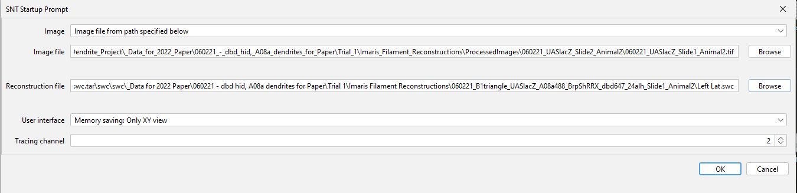

New images from Doe's lab were shared through FTP and they were transferred to the `imaging_dropbox`. The images were transferred to `\2022_09_21_COBA_ChrisDoe_Lab\NewBatch` in `imaging_analysis`. 
The details of the files, 

```
181G    NewBatch/
3.9G    doelab/

3005 : .
2996 : ./NewBatch
   8 : ./doelab

```

The files that were in `imaging_dropbox`

```
179G    doelab/

```

Some of the files were converted to tiff format and saved in the `imaging_analysis` hence we find difference in the folder size. 


Out of the many images that they shared, only some of the files (the files in Z:\2022_09_21_COBA_ChrisDoe_Lab\NewBatch\doelab\dbd_A08a_Dendrite_Project\_Data_for_2022_Paper\060221_-_dbd_hid,_A08a_dendrites_for_Paper\Trial_1\) were compatible with ImageJ Bioformats. Other images were having issues opening in ImageJ hence the initial plan is to include ony these images for training. 

Following steps were followed before adding them to the training set, 

* Open the .ims files in ImageJ using Bioformats and save these files in tiff format.
* With the SNT prompt choose the image file in tiff and one of the swc files as the reconstruction file with the corresponding tracking channel,




* To get all the swc files as one image, SNT -> Load Tracings -> Directory of SWCs 
* In the path manager -> Ctrl A all paths -> Analyze -> Skeletonize 
* Save the masks as tiff 
* Reconstructions do not cover the entire image, only portion of it are annotated. Hence the image is cropped based on the annotated region. 
* The masks, original image are synced and cropped together.  